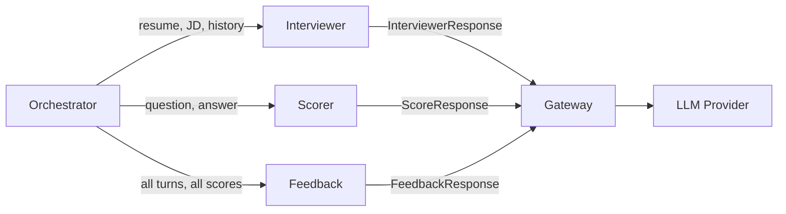
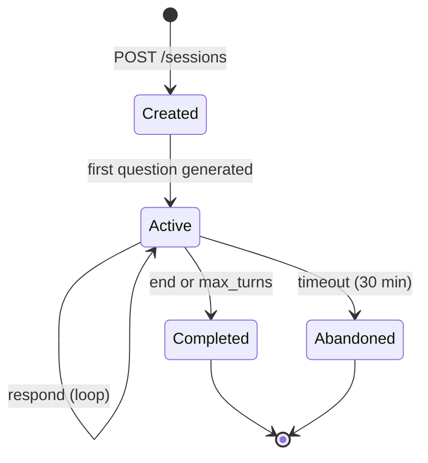

# Agent Designs — AI Interview Coach

> **Principle:** No agent framework. Each agent is a plain Python class
> that (1) builds a prompt, (2) calls the gateway, (3) validates the
> response with Pydantic, and (4) retries on validation failure.
> This is simple, testable, and easy to explain in an interview.

---

## Architecture Overview



Each agent follows the same contract:

```python
class BaseAgent:
    async def run(self, input: AgentInput) -> AgentOutput:
        prompt = self.build_prompt(input)          # 1. Construct
        raw = await gateway.complete(prompt, ...)   # 2. Call
        parsed = self.validate(raw)                 # 3. Validate
        return parsed                               # 4. Return

    def validate(self, raw: str) -> AgentOutput:
        # Pydantic parse; raises on failure
        # Caller retries up to 2x with error feedback
```

---

## 1. Interviewer Agent

### Purpose
Generate the next interview question, adapting topic and difficulty
based on the candidate's performance and coverage gaps.

### Input

```python
class InterviewerInput(BaseModel):
    resume_text: str              # Untrusted — isolated in user message
    jd_text: str                  # Untrusted — isolated in user message
    conversation_history: list[Turn]
    topics_covered: list[str]     # e.g., ["behavioral", "algorithms"]
    scores_so_far: list[DimensionScore]  # avg by dimension
    difficulty_level: int         # Current 1–5
    turn_number: int
    max_turns: int
    question_bank_sample: list[str]  # 3–5 examples for calibration
    focus_topics: list[str] | None   # User-requested focus areas
```

### Output

```python
class InterviewerResponse(BaseModel):
    question: str                 # The interview question
    topic: str                    # Category (behavioral, technical, etc.)
    subtopic: str                 # Specific area (leadership, caching, etc.)
    difficulty: int = Field(ge=1, le=5)
    reasoning: str                # Why this question, for logging/debug
    is_follow_up: bool            # Whether it follows up on previous answer
```

### Prompt Strategy

```
SYSTEM: You are a senior technical interviewer. Your job is to assess
        the candidate for the role described below. Generate ONE
        interview question.

        Rules:
        - Choose a topic NOT in {topics_covered} (ensure breadth)
        - Difficulty target: {difficulty_level}
        - Turn {turn_number} of {max_turns} — pace accordingly
        - If follow-up is warranted by previous answer, ask it
        - Use these examples for difficulty calibration:
          {question_bank_sample}

        Output ONLY valid JSON matching the schema.

USER:   <resume>{resume_text}</resume>
        <job_description>{jd_text}</job_description>
        <conversation_history>{history}</conversation_history>
        <scores_so_far>{scores}</scores_so_far>
```

> [!IMPORTANT]
> Resume and JD are in the USER message, never in SYSTEM. They are
> wrapped in XML tags to prevent delimiter confusion. The safety module
> pre-screens them before they reach the prompt.

### Difficulty Adaptation

```
if avg_score_last_2_turns >= 4.0:
    difficulty = min(difficulty + 1, 5)
elif avg_score_last_2_turns <= 2.0:
    difficulty = max(difficulty - 1, 1)
else:
    difficulty unchanged
```

Starting difficulty is inferred from JD seniority level:
- Junior → 2, Mid → 3, Senior → 4, Staff+ → 5

### Topic Coverage

The orchestrator tracks `topics_covered` and passes it to the agent.
The prompt instructs the agent to pick uncovered topics. If all
categories are covered, the agent may revisit the weakest one.

Topic universe: `behavioral`, `technical`, `system-design`,
`problem-solving`, `culture-fit`, `domain-specific`

### Failure Modes & Handling

| Failure | Detection | Handling |
|---------|-----------|----------|
| Invalid JSON | Pydantic parse error | Retry with error message appended, max 2x |
| Topic already covered | `topic in topics_covered` | Re-run with explicit "avoid {topic}" |
| Difficulty out of range | Pydantic `ge=1, le=5` | Caught by validation, retry |
| Question too similar to prior | Cosine similarity > 0.9 with any prior question | Re-run; log for prompt tuning |
| Empty or gibberish question | `len(question) < 10` | Fallback to question bank |

### Low-Confidence Handling

The Interviewer doesn't produce a confidence score itself. Instead:
- If 2 retries fail validation → fall back to a question bank entry
  (randomly selected from matching topic + difficulty)
- Fallback is logged as `source: "question_bank"` in the turn record

---

## 2. Scorer Agent

### Purpose
Score a single candidate answer on rubric dimensions with quoted
evidence from the answer.

### Input

```python
class ScorerInput(BaseModel):
    question: str
    answer: str
    topic: str
    difficulty: int
    jd_text: str                  # For relevance assessment
    rubric_dimensions: list[str]  # e.g., ["communication", "relevance", "depth"]
```

### Output

```python
class DimensionScore(BaseModel):
    dimension: str
    score: int = Field(ge=1, le=5)
    evidence: str                 # Must be quote/paraphrase from answer
    confidence: float = Field(ge=0.0, le=1.0)

class ScoreResponse(BaseModel):
    answer_type: Literal["attempted", "no_answer"]
    scores: list[DimensionScore]
    overall_impression: str       # 1–2 sentence summary or study hint

    @model_validator(mode="after")
    def check_dimensions_match(self):
        # Ensures all requested dimensions are scored
        ...
```

### Rubric Dimensions

| Dimension | What it measures |
|-----------|-----------------|
| `communication` | Clarity, structure (STAR method), conciseness |
| `relevance` | Directly addresses the question asked |
| `technical_depth` | Accuracy and depth of technical content |
| `problem_solving` | Approach to breaking down problems |
| `examples` | Use of concrete, specific examples |

Dimensions are selected per-question by the orchestrator based on topic:
- Behavioral → communication, relevance, examples
- Technical → relevance, technical_depth, problem_solving
- System Design → all five

### Prompt Strategy

```
SYSTEM: You are an expert interview evaluator. Score the candidate's
        answer on each dimension using this rubric:

        1 = Poor: No relevant content, off-topic
        2 = Below Average: Partially relevant, vague
        3 = Average: Addresses question, some specifics
        4 = Good: Clear, specific, well-structured
        5 = Excellent: Exceptional depth, strong examples, insightful

        Rules:
        - Score each dimension INDEPENDENTLY
        - Evidence MUST be a direct quote or close paraphrase from the answer
        - If the answer doesn't address a dimension, score 1 with
          evidence = "Not addressed"
        - Confidence: how sure you are (0.0–1.0)
        - Output ONLY valid JSON matching the schema

USER:   <question>{question}</question>
        <answer>{answer}</answer>
        <job_description>{jd_text}</job_description>
        Dimensions to score: {rubric_dimensions}
```

### Failure Modes & Handling

| Failure | Detection | Handling |
|---------|-----------|----------|
| Invalid JSON | Pydantic parse | Retry 2x with error context |
| Missing dimensions | Validator `check_dimensions_match` | Retry with explicit reminder |
| Evidence not from answer | Fuzzy match evidence against answer text, threshold 0.3 | Re-score that dimension with "quote directly" |
| All scores identical (1 or 5) | `len(set(s.score for s in scores)) == 1` | Log warning; re-score at temperature 0.3 |
| Confidence always 1.0 | All confidences == 1.0 | Accept but log for prompt tuning |

### Low-Confidence Handling

```python
for dim_score in response.scores:
    if dim_score.confidence < 0.6:
        # Re-score this dimension alone at temperature=0.2
        retry_score = await scorer.rescore_dimension(dim_score.dimension, ...)
        if retry_score.confidence >= 0.6:
            dim_score = retry_score
        else:
            dim_score.needs_review = True  # Flagged in DB
```

---

## 3. Feedback Agent

### Purpose
Synthesize all turns and scores into actionable end-of-session feedback.

### Input

```python
class FeedbackInput(BaseModel):
    turns: list[Turn]             # Full conversation
    scores: list[TurnScores]      # All dimension scores per turn
    resume_text: str              # For personalization
    jd_text: str                  # For role-specific advice
    aggregate_scores: dict[str, float]  # Avg per dimension
```

### Output

```python
class FeedbackResponse(BaseModel):
    summary: str = Field(max_length=500)
    strengths: list[str] = Field(min_length=1, max_length=5)
    improvements: list[str] = Field(min_length=1, max_length=5)
    action_items: list[str] = Field(min_length=1, max_length=5)
    recommended_topics: list[str]
    estimated_readiness: str      # "needs_work", "progressing", "interview_ready"

    @model_validator(mode="after")
    def strengths_and_improvements_differ(self):
        # Ensures no overlap between strengths and improvements
        ...
```

### Prompt Strategy

```
SYSTEM: You are a career coach providing post-interview feedback.
        Synthesize the candidate's performance into actionable advice.

        Rules:
        - Reference SPECIFIC answers (e.g., "In your response about
          leadership, you effectively used the STAR method")
        - Strengths should be genuinely strong areas (score >= 4)
        - Improvements should target the weakest areas (score <= 3)
        - Action items must be concrete and achievable
        - Recommended topics = areas to practice next
        - Be encouraging but honest

        Output ONLY valid JSON matching the schema.

USER:   <resume>{resume_text}</resume>
        <job_description>{jd_text}</job_description>
        <conversation>{formatted_turns_with_scores}</conversation>
        <aggregate_scores>{aggregate_scores}</aggregate_scores>
```

### Failure Modes & Handling

| Failure | Detection | Handling |
|---------|-----------|----------|
| Invalid JSON | Pydantic parse | Retry 2x |
| Generic feedback (no turn refs) | No turn-number references found in text | Retry with "cite specific turn numbers" |
| Contradicts scores | Strength area has avg score < 2 | Log warning; re-run |
| Empty lists | Pydantic `min_length=1` | Caught by validation |
| Overly negative/positive | All "needs_work" despite high scores | Readiness check: if avg >= 4, must be "progressing" or better |

### Low-Confidence Handling

Feedback is generated once per session (not per-turn), so:
- If validation fails 2x → generate a simplified fallback feedback using
  only the aggregate scores (template-based, no LLM)
- Fallback is marked `feedback_source: "template"` in the response
- User can trigger re-generation via UI

---

## Orchestrator — Tying It Together

The orchestrator is a state machine, not an agent framework:



**Per-turn flow:**

1. Receive candidate answer → save as `candidate` turn
2. Dispatch Scorer (async via worker queue) for the answer
3. Call Interviewer agent with updated history + scores
4. Save interviewer turn → stream/return to client

**End-of-session flow:**

1. Wait for all pending scores to complete
2. Compute aggregate scores → update session
3. Call Feedback agent
4. Save feedback → mark session `completed`
5. Schedule review via `review_schedule`

> [!TIP]
> **Why not an agent framework?** The flow is a simple linear pipeline
> with well-defined handoffs. A framework (LangChain, CrewAI) would add
> dependency weight, debugging opacity, and conversation complexity
> without clear value. Each agent is one class, one prompt file, one
> Pydantic model. You can read the entire system in 30 minutes.
