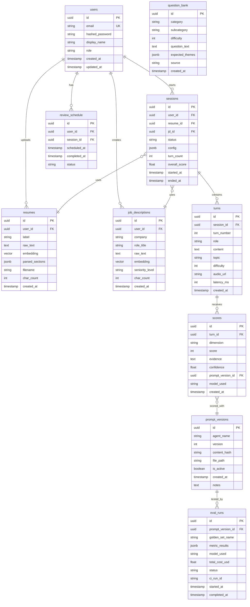

# Database Schema — AI Interview Coach

> **Engine:** PostgreSQL 16 + pgvector extension
> **ORM:** SQLAlchemy 2.0 (async)
> **Migrations:** Alembic

---

## ER Diagram

---

## Table Details

### `users`

| Column | Type | Constraints | Notes |
|--------|------|-------------|-------|
| `id` | UUID | PK, default gen | |
| `email` | VARCHAR(255) | UNIQUE, NOT NULL | Normalized to lowercase |
| `hashed_password` | VARCHAR(255) | NOT NULL | bcrypt hash |
| `display_name` | VARCHAR(100) | NOT NULL | |
| `role` | VARCHAR(20) | NOT NULL, default `'user'` | `user` or `admin` |
| `created_at` | TIMESTAMPTZ | NOT NULL, default now | |
| `updated_at` | TIMESTAMPTZ | NOT NULL, default now | Auto-updated |

**Indexes:** `ix_users_email` (unique)

---

### `resumes`

| Column | Type | Constraints | Notes |
|--------|------|-------------|-------|
| `id` | UUID | PK | |
| `user_id` | UUID | FK → users.id, ON DELETE CASCADE | |
| `label` | VARCHAR(200) | | User-given name |
| `raw_text` | TEXT | NOT NULL | Extracted from PDF/DOCX |
| `embedding` | VECTOR(1536) | | pgvector; dim matches model |
| `parsed_sections` | JSONB | | `{experience: [...], skills: [...]}` |
| `filename` | VARCHAR(255) | NOT NULL | Original filename |
| `char_count` | INTEGER | NOT NULL | For quick display |
| `created_at` | TIMESTAMPTZ | NOT NULL | |

**Indexes:** `ix_resumes_user_id`, HNSW index on `embedding`

> [!NOTE]
> Embedding dimension (1536) assumes `text-embedding-3-small`. Change via
> config if switching models. Alembic migration handles column alter.

---

### `job_descriptions`

| Column | Type | Constraints | Notes |
|--------|------|-------------|-------|
| `id` | UUID | PK | |
| `user_id` | UUID | FK → users.id, ON DELETE CASCADE | |
| `company` | VARCHAR(200) | | |
| `role_title` | VARCHAR(200) | NOT NULL | |
| `raw_text` | TEXT | NOT NULL | |
| `embedding` | VECTOR(1536) | | |
| `seniority_level` | VARCHAR(50) | | Inferred: junior/mid/senior/staff |
| `char_count` | INTEGER | NOT NULL | |
| `created_at` | TIMESTAMPTZ | NOT NULL | |

**Indexes:** `ix_jd_user_id`, HNSW index on `embedding`

---

### `sessions`

| Column | Type | Constraints | Notes |
|--------|------|-------------|-------|
| `id` | UUID | PK | |
| `user_id` | UUID | FK → users.id, ON DELETE CASCADE | |
| `resume_id` | UUID | FK → resumes.id, ON DELETE SET NULL | |
| `jd_id` | UUID | FK → job_descriptions.id, ON DELETE SET NULL | |
| `status` | VARCHAR(20) | NOT NULL, default `'active'` | `active`, `completed`, `abandoned` |
| `config` | JSONB | NOT NULL | `{difficulty, max_turns, focus_topics}` |
| `turn_count` | INTEGER | NOT NULL, default 0 | Denormalized for quick display |
| `overall_score` | FLOAT | | Computed when session ends |
| `started_at` | TIMESTAMPTZ | NOT NULL | |
| `ended_at` | TIMESTAMPTZ | | |

**Indexes:** `ix_sessions_user_id`, `ix_sessions_status`

---

### `turns`

| Column | Type | Constraints | Notes |
|--------|------|-------------|-------|
| `id` | UUID | PK | |
| `session_id` | UUID | FK → sessions.id, ON DELETE CASCADE | |
| `turn_number` | INTEGER | NOT NULL | 1-indexed |
| `role` | VARCHAR(20) | NOT NULL | `interviewer` or `candidate` |
| `content` | TEXT | NOT NULL | Question or answer text |
| `topic` | VARCHAR(100) | | Only for interviewer turns |
| `difficulty` | INTEGER | | 1–5, only for interviewer turns |
| `audio_url` | VARCHAR(500) | | S3/GCS URL for voice input |
| `latency_ms` | INTEGER | | LLM response time |
| `created_at` | TIMESTAMPTZ | NOT NULL | |

**Indexes:** `ix_turns_session_id`, UNIQUE(`session_id`, `turn_number`)

---

### `scores`

| Column | Type | Constraints | Notes |
|--------|------|-------------|-------|
| `id` | UUID | PK | |
| `turn_id` | UUID | FK → turns.id, ON DELETE CASCADE | |
| `dimension` | VARCHAR(50) | NOT NULL | e.g., `communication`, `relevance`, `technical_depth` |
| `score` | INTEGER | NOT NULL, CHECK 1–5 | |
| `evidence` | TEXT | NOT NULL | Quote from answer justifying score |
| `confidence` | FLOAT | NOT NULL, CHECK 0–1 | Model self-assessed confidence |
| `prompt_version_id` | UUID | FK → prompt_versions.id | Which prompt produced this score |
| `model_used` | VARCHAR(100) | NOT NULL | e.g., `gemini-2.0-flash` |
| `created_at` | TIMESTAMPTZ | NOT NULL | |

**Indexes:** `ix_scores_turn_id`

---

### `question_bank`

| Column | Type | Constraints | Notes |
|--------|------|-------------|-------|
| `id` | UUID | PK | |
| `category` | VARCHAR(50) | NOT NULL | `behavioral`, `technical`, `system-design` |
| `subcategory` | VARCHAR(100) | | `leadership`, `conflict`, `algorithms` |
| `difficulty` | INTEGER | NOT NULL, CHECK 1–5 | |
| `question_text` | TEXT | NOT NULL | |
| `expected_themes` | JSONB | | `["STAR method", "metrics", "teamwork"]` |
| `source` | VARCHAR(100) | | `seed`, `generated`, `community` |
| `created_at` | TIMESTAMPTZ | NOT NULL | |

**Indexes:** `ix_qb_category_difficulty`

> [!TIP]
> The question bank seeds the Interviewer agent. It is NOT used to
> hard-code questions — the agent generates novel questions but uses
> bank entries as style/difficulty calibrators.

---

### `review_schedule`

| Column | Type | Constraints | Notes |
|--------|------|-------------|-------|
| `id` | UUID | PK | |
| `user_id` | UUID | FK → users.id, ON DELETE CASCADE | |
| `session_id` | UUID | FK → sessions.id, ON DELETE CASCADE | |
| `scheduled_at` | TIMESTAMPTZ | NOT NULL | Next review date |
| `completed_at` | TIMESTAMPTZ | | |
| `status` | VARCHAR(20) | NOT NULL, default `'pending'` | `pending`, `completed`, `skipped` |

**Indexes:** `ix_review_user_status`

---

### `prompt_versions`

| Column | Type | Constraints | Notes |
|--------|------|-------------|-------|
| `id` | UUID | PK | |
| `agent_name` | VARCHAR(50) | NOT NULL | `interviewer`, `scorer`, `feedback` |
| `version` | INTEGER | NOT NULL | Monotonically increasing |
| `content_hash` | VARCHAR(64) | NOT NULL | SHA-256 of file content |
| `file_path` | VARCHAR(200) | NOT NULL | `prompts/interviewer/v1.md` |
| `is_active` | BOOLEAN | NOT NULL, default false | Only one active per agent |
| `created_at` | TIMESTAMPTZ | NOT NULL | |
| `notes` | TEXT | | Changelog for this version |

**Indexes:** UNIQUE(`agent_name`, `version`), partial index on `is_active = true`

---

### `eval_runs`

| Column | Type | Constraints | Notes |
|--------|------|-------------|-------|
| `id` | UUID | PK | |
| `prompt_version_id` | UUID | FK → prompt_versions.id | |
| `golden_set_name` | VARCHAR(100) | NOT NULL | Filename in `evals/golden/` |
| `metric_results` | JSONB | NOT NULL | `{score_mae, consistency_std, ...}` |
| `model_used` | VARCHAR(100) | NOT NULL | |
| `total_cost_usd` | FLOAT | | |
| `status` | VARCHAR(20) | NOT NULL | `running`, `completed`, `failed` |
| `ci_run_id` | VARCHAR(200) | | GitHub Actions run ID |
| `started_at` | TIMESTAMPTZ | NOT NULL | |
| `completed_at` | TIMESTAMPTZ | | |

**Indexes:** `ix_eval_runs_prompt_version`

---

## Design Decisions

- **UUIDs everywhere:** Avoids leaking sequence info; safe for public URLs.
- **JSONB for config/metrics:** Avoids schema churn for evolving config shapes. Validated by Pydantic before write.
- **ON DELETE CASCADE from users:** Account deletion removes everything. Clean GDPR compliance.
- **pgvector HNSW indexes:** Approximate nearest-neighbor search for resume/JD similarity. Exact match is too slow at scale.
- **Denormalized `turn_count` on sessions:** Avoids `COUNT(*)` on every list query.
- **`prompt_version_id` on scores:** Full traceability — every score links back to the exact prompt that produced it.
