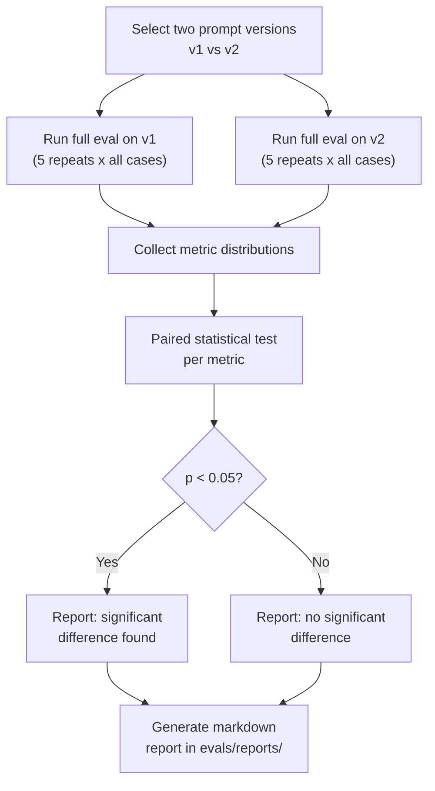

# Eval Design — AI Interview Coach

> **Rule 7 from AGENTS.md:** Never modify `evals/golden/` (human-labeled data).
> Eval runs are reproducible, automated, and gate PRs in CI.

---

## Module Structure

```
evals/
├── golden/                   # IMMUTABLE human-labeled data
│   ├── interviewer.jsonl     # Interviewer agent test cases
│   ├── scorer.jsonl          # Scorer agent test cases
│   └── feedback.jsonl        # Feedback agent test cases
├── runner/
│   ├── run_eval.py           # Main eval entry point
│   ├── agents.py             # Thin wrappers that call each agent
│   └── config.py             # Eval run configuration
├── metrics/
│   ├── score_accuracy.py     # MAE, consistency
│   ├── feedback_quality.py   # Coverage, contradiction detection
│   ├── question_quality.py   # Relevance, diversity
│   └── cost.py               # Latency + spend per run
├── reports/
│   └── (auto-generated markdown reports)
└── prompt_ab/
    ├── compare.py            # A/B comparison logic
    └── significance.py       # Statistical tests
```

---

## 1. Golden Set Format

Each golden set is a JSONL file (one JSON object per line). Format
varies by agent type.

### Scorer Golden Set (`evals/golden/scorer.jsonl`)

```jsonc
{
  "id": "sc-001",
  "category": "behavioral",
  "input": {
    "question": "Tell me about a time you led a project under a tight deadline.",
    "answer": "At Acme Corp, I led a team of five engineers to deliver a payment migration in 3 weeks. I broke the project into daily milestones, held 15-min standups, and personally handled the riskiest integration. We shipped on time with zero rollbacks.",
    "jd_text": "Senior Backend Engineer at FinCo. Requires leadership experience and delivery under pressure.",
    "rubric_dimensions": ["communication", "relevance", "examples"]
  },
  "expected": {
    "answer_type": "attempted",
    "scores": {
      "communication": { "min": 4, "max": 5 },
      "relevance":     { "min": 4, "max": 5 },
      "examples":      { "min": 4, "max": 5 }
    },
    "evidence_must_reference": ["team of five", "3 weeks", "zero rollbacks"]
  },
  "metadata": {
    "labeler": "human-aditya",
    "created_at": "2024-06-15",
    "difficulty": "medium",
    "notes": "Strong STAR response with quantifiable results"
  }
}
{
  "id": "sc-002",
  "category": "technical",
  "input": {
    "question": "How does a Bloom filter work?",
    "answer": "I don't know actually. I've never used one.",
    "jd_text": "Backend Engineer. Requires knowledge of probabilistic data structures.",
    "rubric_dimensions": ["technical_depth"]
  },
  "expected": {
    "answer_type": "no_answer",
    "scores": {
      "technical_depth": { "min": 1, "max": 1 }
    },
    "evidence_must_reference": ["never used one", "don't know"]
  },
  "metadata": {
    "labeler": "human-aditya",
    "created_at": "2024-06-15",
    "difficulty": "hard",
    "notes": "Explicit non-answer"
  }
}
```

### Interviewer Golden Set (`evals/golden/interviewer.jsonl`)

```jsonc
{
  "id": "int-001",
  "category": "topic_coverage",
  "input": {
    "resume_text": "5 years Python, AWS, led 3 projects...",
    "jd_text": "Senior Backend Engineer. System design, mentoring, API design.",
    "topics_covered": ["behavioral"],
    "difficulty_level": 3,
    "turn_number": 3,
    "max_turns": 8
  },
  "expected": {
    "topic_not_in": ["behavioral"],
    "topic_should_be_one_of": ["technical", "system-design"],
    "difficulty_range": { "min": 2, "max": 4 },
    "is_relevant_to_jd": true
  },
  "metadata": {
    "labeler": "human-aditya",
    "created_at": "2024-06-15"
  }
}
```

### Feedback Golden Set (`evals/golden/feedback.jsonl`)

```jsonc
{
  "id": "fb-001",
  "input": {
    "turns": [ /* 6 turns of conversation */ ],
    "scores": [ /* per-turn dimension scores */ ],
    "resume_text": "...",
    "jd_text": "...",
    "aggregate_scores": {
      "communication": 4.2,
      "relevance": 3.5,
      "technical_depth": 2.8
    }
  },
  "expected": {
    "strengths_must_mention": ["communication", "STAR"],
    "improvements_must_mention": ["technical depth"],
    "action_items_min_count": 2,
    "readiness_in": ["progressing"]
  },
  "metadata": {
    "labeler": "human-aditya",
    "created_at": "2024-06-15"
  }
}
```

> [!IMPORTANT]
> Golden sets are human-labeled and IMMUTABLE. To fix a labeling error,
> add a new corrected entry and mark the old one with `"deprecated": true`.
> Never delete or edit an existing entry.

---

## 2. Metrics

### Scorer Metrics

| Metric | Formula | Target |
|--------|---------|--------|
| **Score MAE** | Mean of \|predicted_score − midpoint(expected_range)\| across all dimensions and cases | < 1.0 |
| **In-Range Rate** | % of predicted scores that fall within `[min, max]` of expected | > 75% |
| **Score Consistency** | Std dev of scores across N=5 repeat runs of the same input | σ < 0.5 |
| **Evidence Hit Rate** | % of `evidence_must_reference` items found (fuzzy match) in model's evidence | > 80% |

### Interviewer Metrics

| Metric | Formula | Target |
|--------|---------|--------|
| **Topic Compliance** | % of cases where generated topic ∉ `topic_not_in` | 100% |
| **Topic Relevance** | % of cases where generated topic ∈ `topic_should_be_one_of` | > 80% |
| **Difficulty Compliance** | % of cases where difficulty ∈ `[min, max]` range | > 85% |
| **JD Relevance** | Human-judged (sampled) or embedding-similarity to JD | > 0.7 cosine |

### Feedback Metrics

| Metric | Formula | Target |
|--------|---------|--------|
| **Strength Coverage** | % of `strengths_must_mention` items present in output | > 80% |
| **Improvement Coverage** | % of `improvements_must_mention` items present | > 80% |
| **Action Item Count** | Count of action items ≥ `action_items_min_count` | 100% |
| **Readiness Accuracy** | `estimated_readiness ∈ readiness_in` | > 90% |

### Cross-Cutting Metrics

| Metric | Measured On | Target |
|--------|-------------|--------|
| **Latency p50** | All agents | < 2s |
| **Latency p95** | All agents | < 5s |
| **Cost per run** | Full eval suite | < \$5 |
| **Pydantic validation pass rate** | All agents | > 95% (before retries) |

---

## 3. Repeat Runs (Consistency)

Every eval runs each golden-set case **N=5 times** (configurable).

```python
# runner/run_eval.py
async def run_eval(golden_set: str, prompt_version: str, repeats: int = 5):
    results = []
    for case in load_golden_set(golden_set):
        case_results = []
        for _ in range(repeats):
            output = await agent.run(case["input"])
            metrics = compute_metrics(output, case["expected"])
            case_results.append(metrics)
        results.append({
            "case_id": case["id"],
            "mean_metrics": mean(case_results),
            "std_metrics": std(case_results),
        })
    return results
```

**Why repeat?** LLM outputs are non-deterministic even at temperature=0
(provider-side sampling can vary). Repeat runs measure reliability.

A case is flagged as **unstable** if `std(score) > 0.8` across repeats.

---

## 4. Prompt A/B Comparison

### Workflow



### Statistical Test

```python
# prompt_ab/significance.py
from scipy.stats import wilcoxon

def compare_versions(
    metrics_v1: list[float],
    metrics_v2: list[float],
    metric_name: str,
    alpha: float = 0.05,
) -> ABResult:
    stat, p_value = wilcoxon(metrics_v1, metrics_v2)
    return ABResult(
        metric=metric_name,
        v1_mean=mean(metrics_v1),
        v2_mean=mean(metrics_v2),
        p_value=p_value,
        significant=p_value < alpha,
        winner="v2" if mean(metrics_v2) > mean(metrics_v1) else "v1",
    )
```

**Why Wilcoxon (not t-test)?** Paired, non-parametric — makes no
assumption about score distribution. Works well with small N.

### Report Format

Generated as `evals/reports/{timestamp}_{v1}_vs_{v2}.md`:

```markdown
# Prompt A/B Report: scorer/v1 vs scorer/v2
Date: 2024-06-15  |  Model: gemini-2.0-flash  |  Cases: 15  |  Repeats: 5

| Metric             | v1 (mean) | v2 (mean) | p-value | Significant? | Winner |
|--------------------|-----------|-----------|---------|--------------|--------|
| Score MAE          | 0.85      | 0.72      | 0.012   | ✅ Yes       | v2     |
| Consistency (σ)    | 0.42      | 0.38      | 0.23    | ❌ No        | —      |
| Evidence Hit Rate  | 0.81      | 0.88      | 0.034   | ✅ Yes       | v2     |

**Recommendation:** Promote v2 to active.
```

---

## 5. CI Gate

### GitHub Actions Integration

```yaml
# .github/workflows/eval-gate.yml
name: Eval Gate
on:
  pull_request:
    paths:
      - 'prompts/**'
      - 'backend/agents/**'
      - 'backend/gateway/**'

jobs:
  eval:
    runs-on: ubuntu-latest
    steps:
      - uses: actions/checkout@v4
      - name: Run eval suite
        run: python -m evals.runner.run_eval --all --repeats 3
        env:
          GEMINI_API_KEY: ${{ secrets.GEMINI_API_KEY }}
      - name: Check thresholds
        run: python -m evals.runner.check_thresholds
```

### Threshold Rules

```python
# runner/check_thresholds.py
THRESHOLDS = {
    "scorer": {
        "score_mae": {"max": 1.0, "direction": "lower_is_better"},
        "score_consistency_std": {"max": 0.5, "direction": "lower_is_better"},
        "evidence_hit_rate": {"min": 0.80, "direction": "higher_is_better"},
        "in_range_rate": {"min": 0.75, "direction": "higher_is_better"},
    },
    "interviewer": {
        "topic_compliance": {"min": 1.0, "direction": "higher_is_better"},
        "topic_relevance": {"min": 0.80, "direction": "higher_is_better"},
        "difficulty_compliance": {"min": 0.85, "direction": "higher_is_better"},
    },
    "feedback": {
        "strength_coverage": {"min": 0.80, "direction": "higher_is_better"},
        "improvement_coverage": {"min": 0.80, "direction": "higher_is_better"},
        "readiness_accuracy": {"min": 0.90, "direction": "higher_is_better"},
    },
}

REGRESSION_TOLERANCE = 0.10  # 10% regression vs main branch = block
```

### Gate Logic

1. **Absolute thresholds:** Eval must meet all thresholds above.
2. **Regression check:** Compare vs. last passing eval on `main`.
   Block if any metric regresses by more than 10%.
3. **Cost guard:** If eval run costs > \$10, warn but don't block.

> [!NOTE]
> CI evals use `--repeats 3` (not 5) to save cost and time.
> Full 5-repeat runs are done manually before promoting a prompt version.

---

## Golden Set Sizing Guidelines

| Agent | Minimum Cases | Target Cases | Growth Strategy |
|-------|---------------|--------------|-----------------|
| Scorer | 15 | 50 | Add cases when new rubric dimensions are added |
| Interviewer | 10 | 30 | Add cases for each new topic category |
| Feedback | 10 | 25 | Add cases with diverse score distributions |

Start with the minimums. Quality of labels matters more than quantity.
Each case should be reviewed by at least one other person before merging.
