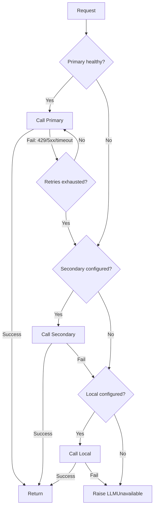

# Gateway Design — AI Interview Coach

> **Rule 3 from AGENTS.md:** All LLM calls go through `backend/gateway`.
> No direct SDK calls elsewhere. The gateway handles provider abstraction,
> retries, routing, caching, fallback, and logging of tokens, latency, and cost.

---

## Module Structure

```
backend/gateway/
├── __init__.py          # Exports LLMGateway
├── client.py            # LLMGateway class — the single entry point
├── providers/
│   ├── base.py          # AbstractProvider protocol
│   ├── google.py        # Gemini (google-genai SDK)
│   ├── openai_compat.py # OpenAI + any OpenAI-compatible local endpoint
│   └── anthropic.py     # Anthropic (optional secondary)
├── routing.py           # Provider selection logic
├── cache.py             # Redis-based response cache
├── retry.py             # Retry with exponential backoff + jitter
├── cost.py              # Token counting and cost calculation
└── models.py            # Pydantic request/response models
```

---

## Provider Abstraction

```python
# providers/base.py
class LLMProvider(Protocol):
    name: str

    async def complete(
        self,
        messages: list[Message],
        model: str,
        temperature: float,
        max_tokens: int,
        response_format: type[BaseModel] | None,
    ) -> LLMResult: ...

    async def stream(
        self,
        messages: list[Message],
        model: str,
        temperature: float,
        max_tokens: int,
    ) -> AsyncIterator[str]: ...

@dataclass
class LLMResult:
    content: str
    model: str
    provider: str
    input_tokens: int
    output_tokens: int
    latency_ms: int
    cached: bool
```

### Supported Providers

| Provider | SDK | Models | Use Case |
|----------|-----|--------|----------|
| **Google Gemini** | `google-genai` | `gemini-2.0-flash`, `gemini-2.5-pro` | Primary — best cost/quality ratio |
| **OpenAI-compatible** | `openai` | Any model behind OpenAI-compatible API | Local dev (Ollama, vLLM), or OpenAI production |
| **Anthropic** | `anthropic` | Claude Sonnet | Secondary fallback |

> [!TIP]
> The OpenAI-compatible provider works with Ollama, vLLM, LiteLLM, or any
> server exposing `/v1/chat/completions`. Set `OPENAI_COMPAT_BASE_URL` in
> `.env` to point at your local endpoint for free local development.

---

## Routing

```python
# routing.py
class Router:
    def select_provider(
        self,
        agent_type: str,        # "interviewer", "scorer", "feedback"
        prefer_streaming: bool,
    ) -> ProviderConfig:
        """
        Selection order:
        1. Config-driven: each agent type has a preferred provider+model
        2. Health check: skip providers with >5% error rate in last 5 min
        3. Fallback chain: primary → secondary → local
        """
```

### Configuration (`.env` / config)

```python
# config.py (Pydantic Settings)
class GatewayConfig(BaseSettings):
    # Primary
    primary_provider: str = "google"
    primary_model: str = "gemini-2.0-flash"

    # Secondary
    secondary_provider: str = "openai_compat"
    secondary_model: str = "gpt-4o-mini"

    # Local fallback
    local_provider: str = "openai_compat"
    local_base_url: str = "http://localhost:11434/v1"
    local_model: str = "llama3.2"

    # Per-agent overrides (optional)
    scorer_model: str | None = None  # Use a stronger model for scoring
```

### Fallback Logic



---

## Caching

```python
# cache.py
class ResponseCache:
    """Redis-based cache for deterministic LLM calls."""

    def cache_key(self, messages, model, temperature) -> str:
        # Only cache when temperature == 0
        if temperature > 0:
            return None
        return f"llm:{sha256(canonical(messages, model))}"

    async def get(self, key: str) -> LLMResult | None: ...
    async def set(self, key: str, result: LLMResult, ttl: int): ...
```

| Setting | Default | Notes |
|---------|---------|-------|
| Cache enabled | `True` | Disable via env var |
| TTL (scorer) | 1 hour | Scoring same Q+A shouldn't change |
| TTL (interviewer) | 0 (no cache) | Questions should vary |
| TTL (feedback) | 30 min | Same session feedback is stable |
| Max cached size | 100 MB | Redis memory budget |

> [!NOTE]
> Cache hits are logged with `cached: true` so cost tracking shows
> actual vs. saved spend.

---

## Retries

```python
# retry.py
class RetryPolicy:
    max_retries: int = 3
    base_delay: float = 1.0       # seconds
    max_delay: float = 10.0
    jitter: float = 0.5           # random ± jitter seconds

    retryable_errors = {
        429,   # Rate limited
        500,   # Server error
        502,   # Bad gateway
        503,   # Service unavailable
        504,   # Timeout
    }

    non_retryable_errors = {
        400,   # Bad request (our fault)
        401,   # Auth error
        403,   # Forbidden
    }
```

**Retry with validation feedback:**

When the LLM returns valid HTTP but invalid JSON/Pydantic:
1. First retry: append the validation error to the prompt
   (`"Your previous response was invalid: {error}. Please fix."`)
2. Second retry: same, with stricter instruction
3. Third failure: raise `AgentValidationError`, caller handles fallback

---

## Cost Logging

Every LLM call (including retries and cache hits) produces a cost record:

```python
# cost.py
class CostRecord(BaseModel):
    timestamp: datetime
    provider: str                 # "google", "openai_compat", "anthropic"
    model: str                    # "gemini-2.0-flash"
    agent_type: str               # "interviewer", "scorer", "feedback"
    session_id: str | None
    input_tokens: int
    output_tokens: int
    cost_usd: float               # Calculated from token pricing table
    latency_ms: int
    cached: bool
    retries: int                  # How many retries were needed
    success: bool

# Pricing table (configurable, updated as prices change)
TOKEN_PRICING = {
    "gemini-2.0-flash": {"input": 0.075 / 1_000_000, "output": 0.30 / 1_000_000},
    "gemini-2.5-pro":   {"input": 1.25  / 1_000_000, "output": 10.0 / 1_000_000},
    "gpt-4o-mini":      {"input": 0.15  / 1_000_000, "output": 0.60 / 1_000_000},
    # Local models: cost = 0 (just compute cost, not billed)
    "llama3.2":         {"input": 0.0,                "output": 0.0},
}
```

### Storage

Cost records are:
1. **Written to DB** — queryable for analytics dashboards
2. **Emitted as OpenTelemetry metric** — for real-time monitoring
3. **Logged to structured log** — for debugging

### Cost Query Example

```sql
-- Daily cost by agent type
SELECT
    date_trunc('day', timestamp) AS day,
    agent_type,
    SUM(cost_usd) AS total_cost,
    COUNT(*) AS calls,
    AVG(latency_ms) AS avg_latency
FROM llm_cost_log
GROUP BY 1, 2
ORDER BY 1 DESC;
```

---

## The Single Entry Point

```python
# client.py
class LLMGateway:
    """THE only way to call an LLM in this codebase."""

    def __init__(self, config, cache, router, cost_logger): ...

    async def complete(
        self,
        messages: list[Message],
        model: str | None = None,       # None = use routing default
        temperature: float = 0.0,
        max_tokens: int = 2048,
        response_format: type[BaseModel] | None = None,
        agent_type: str = "unknown",
        session_id: str | None = None,
    ) -> LLMResult:
        """
        1. Check cache
        2. Route to provider
        3. Call with retry
        4. Log cost
        5. Return result
        """

    async def stream(
        self,
        messages: list[Message],
        model: str | None = None,
        temperature: float = 0.7,
        max_tokens: int = 2048,
        agent_type: str = "unknown",
        session_id: str | None = None,
    ) -> AsyncIterator[str]:
        """
        Streaming variant. No caching (partial results).
        Cost logged after stream completes.
        """
```

> [!WARNING]
> **Enforcement:** A ruff custom rule or import lint check should flag
> any direct import of `google.genai`, `openai`, or `anthropic` outside
> of `backend/gateway/providers/`. This is the most important architectural
> boundary in the codebase.
