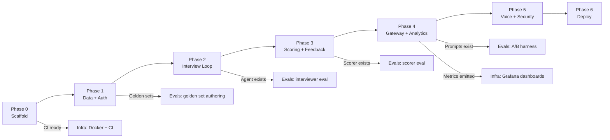

# Implementation Plan — AI Interview Coach

## Repo Structure (Final)

```
ai-interview-coach/
├── backend/
│   ├── api/              # FastAPI routers, deps, middleware
│   ├── agents/           # Interviewer, Scorer, Feedback agent logic
│   ├── orchestrator/     # Session state machine, turn coordinator
│   ├── gateway/          # LLM provider abstraction (THE only LLM exit)
│   ├── context/          # Resume/JD parsing, embedding, retrieval
│   ├── safety/           # Input screening, PII, rate limiting
│   ├── analytics/        # Progress aggregation queries
│   ├── workers/          # Background tasks (scoring, deletion, evals)
│   ├── db/
│   │   ├── models.py     # SQLAlchemy 2 models
│   │   ├── session.py    # Engine / async session factory
│   │   └── migrations/   # Alembic (env.py, versions/)
│   ├── config.py         # Pydantic Settings (env-driven)
│   ├── main.py           # FastAPI app factory
│   └── tests/            # mirrors backend/ structure
├── frontend/             # Next.js (TypeScript) app
│   ├── app/              # App Router pages
│   ├── components/       # React components
│   ├── lib/              # API client, hooks, utils
│   └── __tests__/
├── evals/
│   ├── golden/           # IMMUTABLE human-labeled test cases
│   ├── runner/           # Eval execution scripts
│   ├── metrics/          # Metric computation modules
│   ├── reports/          # Auto-generated markdown reports
│   └── prompt_ab/        # A/B comparison harness
├── prompts/
│   ├── interviewer/v1.md
│   ├── scorer/v1.md
│   └── feedback/v1.md
├── infra/
│   ├── Dockerfile.backend
│   ├── Dockerfile.frontend
│   ├── docker-compose.yml
│   ├── docker-compose.dev.yml
│   └── monitoring/       # Grafana dashboards, Prometheus rules
├── docs/
│   ├── api.md
│   ├── architecture.md
│   ├── decisions/        # ADR-0001-*.md, ADR-0002-*.md …
│   └── screenshots/
├── .github/workflows/    # CI: lint, test, eval gate
├── .env.example
├── AGENTS.md
└── README.md
```

---

## Parallel Lanes

Work is divided into four lanes that can proceed **simultaneously**
without file conflicts. Each lane owns a directory subtree.

| Lane | Owns | Touches shared |
|------|------|----------------|
| **Backend** | `backend/`, `prompts/` | `docs/api.md` (source of truth) |
| **Frontend** | `frontend/` | reads `docs/api.md` |
| **Evals** | `evals/` | reads `prompts/`, reads `backend/gateway/` contract |
| **Infra-Docs** | `infra/`, `docs/`, `.github/` | reads all, writes none in code dirs |

> [!IMPORTANT]
> Cross-lane contract changes are proposed via PRs to `docs/api.md`.
> No lane edits another lane's directory.

---

## Phase 0 — Scaffold & CI *(Day 1–2)*

**Goal:** Runnable empty project with green CI.

| Task | Lane | Acceptance Criteria |
|------|------|---------------------|
| Init FastAPI app with health endpoint | Backend | `GET /healthz` returns 200 |
| Init Next.js app with TypeScript | Frontend | `npm run build` succeeds |
| Docker Compose: Postgres + Redis + backend + frontend | Infra | `docker compose up` starts all services |
| GitHub Actions: ruff, pytest, next lint | Infra | Push triggers all checks, all green |
| Alembic init + empty migration | Backend | `alembic upgrade head` runs clean |
| `.env.example` with all config keys | Infra | Documented, no real secrets |

**Tests:** CI pipeline green on empty project. Health endpoint returns 200.

---

## Phase 1 — Minimal Vertical Slice *(Day 3–6)*

**Goal:** End-to-end foundational API slice: auth, gateway, and minimal interview flow.

| Task | Lane | Acceptance Criteria |
|------|------|---------------------|
| DB models + Migrations | Backend | Users, sessions, turns, scores tables created |
| JWT auth (register, login) | Backend | Tests pass for happy path |
| LLM Gateway | Backend | Provider abstraction, retries, caching, cost logging |
| Minimal Interview Flow | Backend | `POST /sessions`, `POST /sessions/{id}/respond` |
| Scorer Agent | Backend | Generates rubric score + `answer_type` |
| ADR 0001–0005 | Infra-Docs | Written and merged |

**Tests:**
- Unit: Auth, mocked gateway LLM calls
- Integration: Register → start session → answer → receive score

**Deferred to Phase 1.5:**
- Frontend / UI implementation
- Resume parsing / Job Description uploads (Phase 1 will use dummy data or simple strings)
- SSE streaming
- Safety/Input screening

---

## Phase 1.5 — Data Layer & Safety *(Day 7–10)*

**Goal:** Upload resumes/JDs, safety screening, and frontend auth.

| Task | Lane | Acceptance Criteria |
|------|------|---------------------|
| Resume upload + text extraction | Backend | PDF/DOCX → plain text stored |
| Safety module: input screening | Backend | Rejects prompt-injection test strings |
| pgvector extension + embedding column | Backend | Embedding stored on resume/JD save |
| Auth pages (register, login) | Frontend | Can register & log in via UI |
| API client library (`lib/api.ts`) | Frontend | Typed client generated from OpenAPI |

**Tests:**
- Unit: input sanitization
- Integration: full register → login → upload resume flow
- Security: prompt-injection strings in resume text blocked

---

## Phase 2 — Interview Loop *(Day 7–12)*

**Goal:** User starts a session, receives adaptive questions, submits answers via text.

| Task | Lane | Acceptance Criteria |
|------|------|---------------------|
| DB models: sessions, turns, question_bank | Backend | Migration runs |
| Gateway v1: single provider + retries + cost log | Backend | LLM call succeeds, cost row written |
| Interviewer agent: prompt + Pydantic output | Backend | Returns valid `InterviewerResponse` |
| Orchestrator: session state machine | Backend | States: created → active → completed |
| `POST /sessions`, `POST /sessions/{id}/respond` | Backend | Full turn cycle works |
| SSE streaming endpoint | Backend | Tokens stream to client |
| Prompt v1 files for interviewer | Backend | `prompts/interviewer/v1.md` committed |
| Interview UI: session start, chat interface | Frontend | User can have multi-turn conversation |
| SSE client integration | Frontend | Tokens render incrementally |
| Golden set: 10 interviewer cases | Evals | `evals/golden/interviewer.jsonl` committed |
| Eval runner v1: score interviewer output | Evals | Runner executes, report generated |

**Tests:**
- Unit: Interviewer agent with mocked LLM returns valid schema
- Unit: Orchestrator state transitions (valid + invalid)
- Integration: full 3-turn interview session
- Eval: interviewer relevance metric > baseline

---

## Phase 3 — Scoring & Feedback *(Day 13–17)*

**Goal:** Each answer is scored on rubric dimensions with evidence. Session ends with actionable feedback.

| Task | Lane | Acceptance Criteria |
|------|------|---------------------|
| DB models: scores | Backend | Migration runs |
| Scorer agent: prompt + Pydantic output | Backend | Returns `ScoreResponse` with evidence |
| Feedback agent: prompt + Pydantic output | Backend | Returns `FeedbackResponse` |
| Background worker: async scoring | Backend | Score computed after each turn |
| `GET /sessions/{id}/scores`, `GET /sessions/{id}/feedback` | Backend | Returns structured data |
| `POST /sessions/{id}/end` triggers feedback gen | Backend | Feedback available within 30s |
| Prompt v1 files for scorer, feedback | Backend | Committed to `prompts/` |
| Score display in UI | Frontend | Per-turn rubric scores visible |
| Feedback summary page | Frontend | Rendered after session ends |
| Golden set: 15 scorer cases | Evals | Committed |
| Scorer eval metrics: MAE, consistency | Evals | Runner computes both |
| ADR-0002: Async scoring (worker vs inline) | Infra-Docs | Written |

**Tests:**
- Unit: Scorer validates evidence is substring of answer
- Unit: Feedback references actual turn content
- Integration: end session → feedback available
- Eval: scorer MAE < 1.0, consistency σ < 0.5

---

## Phase 4 — Gateway Hardening & Analytics *(Day 18–22)*

**Goal:** Multi-provider fallback, caching, full cost tracking. User sees progress over time.

| Task | Lane | Acceptance Criteria |
|------|------|---------------------|
| Gateway: provider abstraction (2+ providers) | Backend | Fallback works when primary fails |
| Gateway: Redis response cache | Backend | Cache hit returns instantly, logged |
| Gateway: cost dashboard data | Backend | Tokens + cost per session queryable |
| Analytics endpoints: progress, strengths | Backend | Aggregated data returned |
| DB: review_schedule, prompt_versions tables | Backend | Migrations run |
| Spaced-repetition scheduling | Backend | Next review date calculated |
| Analytics dashboard page | Frontend | Charts for score trends, topics |
| Review reminder UI | Frontend | Shows upcoming review sessions |
| Eval: prompt A/B harness | Evals | Compares two prompt versions statistically |
| Grafana dashboard configs | Infra | LLM ops dashboard importable |
| ADR-0003: Caching strategy | Infra-Docs | Written |

**Tests:**
- Unit: fallback chain, cache key generation, cost calculation
- Integration: provider failover mid-session
- Eval: A/B harness produces significance report

---

## Phase 5 — Voice, Polish & Security Hardening *(Day 23–27)*

**Goal:** Voice input works. Rate limits enforced. PII redacted from logs. Data deletion works.

| Task | Lane | Acceptance Criteria |
|------|------|---------------------|
| Voice input: browser MediaRecorder → Whisper API | Backend + Frontend | Audio transcribed, used as answer |
| Rate limiting middleware (Redis) | Backend | 429 returned when exceeded |
| PII redaction in logs | Backend | No emails/phones in log output |
| Account deletion cascade | Backend | `DELETE /auth/me` removes all data |
| Data retention worker | Backend | Old data pruned on schedule |
| CI eval gate in GitHub Actions | Infra | PR blocked if metrics regress >10% |
| Security test suite (prompt injection) | Backend | All 10 injection vectors blocked |
| Load test script | Infra | 50 concurrent users, p99 < 3s |
| Final docs pass | Infra-Docs | README, api.md, architecture.md current |

**Tests:**
- Unit: rate limiter, PII regex patterns
- Integration: full voice flow (mocked Whisper)
- Security: all prompt-injection test cases pass
- Load: p99 latency under target

---

## Phase 6 — Deploy & Observe *(Day 28–30)*

**Goal:** Production deployment with monitoring.

| Task | Lane | Acceptance Criteria |
|------|------|---------------------|
| Production Dockerfile optimization | Infra | Multi-stage, < 200MB image |
| Deploy script (Cloud Run / Railway / VPS) | Infra | One-command deploy |
| OpenTelemetry instrumentation | Backend | Traces visible in collector |
| Alerting rules | Infra | Alerts fire on simulated failure |
| Final README with demo instructions | Infra-Docs | Reviewer can run locally in < 5 min |

**Tests:**
- Smoke test suite against deployed environment
- Verify traces appear for full interview flow
- Alert fires when LLM provider is blocked

---

## Dependency Graph



> [!NOTE]
> Evals and infra-docs run in parallel with backend/frontend and only
> depend on specific milestones (an agent existing, metrics being emitted).
